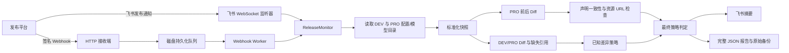

# AM 首屏配置巡检系统总结与跨项目复用指南

> 文档定位：面向需要理解、维护或复制巡检能力的 AI 与工程人员。
>
> 依据范围：`am-config-inspector` 当前源码、测试、README 和本地产物；核对日期为 2026-07-22。
>
> 阅读约定：文中“当前实现”是已经存在的 AM 行为；“复用建议”是迁移到其他项目时推荐的设计，不代表 AM 当前已经完成该改造。

## 1. 一句话结论

AM 首屏配置巡检不是普通的 JSON Diff，而是一套“发布事实核验系统”：它在配置发布后重新读取 DEV、PRO 和模型目录，把不稳定的接口数据转换成稳定快照，对比发布前后的实际变化，核对发布通知是否如实声明了变化，验证新增或变更资源是否可访问，并用“已知差异基线”隔离历史遗留问题，最后通过飞书输出摘要、在磁盘保存完整证据。

它最值得其他项目复用的不是 AM 的字段名，而是以下设计原则：

1. 原始数据、标准化快照、差异报告、判定结果分层保存，任何结论都能追溯。
2. 同时回答三个不同问题：本次发布改了什么、DEV 与 PRO 是否符合预期、发布声明是否与事实一致。
3. 区分“历史已知问题”和“本次新增问题”，避免巡检因旧债长期全红而失去作用。
4. 先持久化事件，再异步巡检；巡检重试与通知重试分离，避免重复推进业务基线。
5. 只有具备稳定标识、明确顺序语义和可配置忽略规则的结构化 Diff，才适合成为自动化判定依据。

## 2. 系统目标、范围与非目标

### 2.1 当前解决的问题

系统围绕一次 `DEV → PRO` 的 AM 首屏配置发布，完成以下核验：

- 发布通知能否被完整解析，是否包含发布成功标识、操作人和正确的发布方向。
- 当前 DEV 与 PRO 是否出现新的配置差异。
- 当前 PRO 是否新增了引用不存在模型 ID 的错误关系。
- PRO 发布后相对上一次保存的 PRO 基线实际发生了哪些变化。
- 通知中声明的变化是否都发生了，实际发生的变化是否都被声明了。
- 本次新增或修改涉及的 HTTP/HTTPS 资源 URL 是否格式正确、是否能访问。
- 原始接口响应、标准化快照、检查结果和发布前后备份是否完整留档。

### 2.2 当前不是发布阻断器

当前系统是异步的发布后巡检与告警系统，不是同步发布闸门：

- 飞书入口是在收到“发布成功”消息后开始检查。
- Webhook 首次请求在事件安全落盘后返回 `202`，不等待巡检结论。
- 当前没有任务状态查询 API、自动回滚或阻止发布继续执行的能力。

如果其他项目需要“发布前阻断”，应复用核心检查器，但需要额外增加同步 Gate、结果查询、超时策略和发布平台回调，不能直接把当前 Webhook 的 `202` 当成巡检通过。

### 2.3 当前数据覆盖边界

标准化快照只覆盖以下业务对象：

- 首页分组：`tabs`、`ai_video_tabs`、`ai_filter_tabs`、`ai_editor_tabs`。
- 完整模型目录：从 `/config/v4` 返回的 `model_url` 再次获取。
- 新手引导页：`intro_list`。
- 少量元数据：`last_update_time`、`version`、`model_url`，这些元数据只随报告保存，不参与业务变化分类。

`/config/v4` 中未被标准化器纳入的其他顶层字段不会参与 Diff。这是迁移时最需要主动确认的边界：不能因为系统抓取了完整原始响应，就误以为所有字段都被判定了。

## 3. 核心概念

| 概念 | 含义 | 当前载体 |
| --- | --- | --- |
| 原始响应 | 服务端实际返回的配置和模型目录，保留取证能力 | `config`、`models` |
| 标准化快照 | 消除无意义顺序、键顺序和类型噪声后的稳定业务视图 | `AM_HOME_CONFIG` |
| 移动 PRO 基线 | 上一次已经抓取并归档的 PRO 快照，用于计算本次 PRO 前后变化 | `pro-baseline.json` |
| 已知差异基线 | 首次启用时确认存在的 DEV/PRO 差异与 PRO 缺失引用 | `known-differences.json` |
| 环境备份 | 同一时点 DEV、PRO 的原始响应、快照、缺失引用和请求信息 | `AM_DEV_PRO_CONFIG_BACKUP` |
| 发布事实 Diff | 上一次 PRO 与本次 PRO 的差异 | `PRO_RELEASE_DIFF` |
| 环境一致性 Diff | 当前 DEV 与当前 PRO 的差异 | `DEV_PRO_DIFF` |
| 声明一致性 | 通知声明与 PRO 实际变化的一对一核对结果 | `PUBLISH_DECLARATION_CONSISTENCY` |
| 巡检结果 | 汇总所有检查及最终通过状态 | `inspection.json` |
| Webhook 任务 | 已验签并落盘、可恢复和重试的事件状态机 | `AM_HOME_CONFIG_WEBHOOK_JOB` |

移动 PRO 基线和已知差异基线不能混为一谈：前者每次成功抓取并保存报告后推进，用来识别“这一次改了什么”；后者默认永久冻结，用来识别“是否出现了新的环境问题”。

## 4. 总体架构与一次巡检的完整链路



一次可判定的巡检按以下顺序发生：

1. 接收并路由事件，只接受目标群或已验签的 Webhook。
2. 解析发布通知；存在未知行也视为未完整解析，立即失败且不请求配置接口。
3. 并行读取当前 DEV 和 PRO 的 `/config/v4`，再读取各自的模型目录。
4. 对两套原始数据分别生成确定性快照并检查分组中的模型引用是否存在。
5. 当前 DEV 对比当前 PRO，得到环境一致性 Diff。
6. 上一次 PRO 基线对比当前 PRO，得到本次发布事实 Diff。
7. 把发布通知声明原子化，把实际变化原子化，执行一对一匹配。
8. 从本次 PRO Diff 中提取新增或变更后的资源 URL，执行可用性检查。
9. 用已知差异基线过滤历史 DEV/PRO 差异和历史缺失引用，只让新增问题阻断。
10. 组合最终判定，保存完整报告、发布前后环境备份和当前快照。
11. 推进移动 PRO 基线；已知差异基线不自动变化。
12. 发送飞书摘要。Webhook 路径会先保存巡检结果，再单独重试飞书投递。

## 5. 配置读取层

### 5.1 AM 当前接口与请求身份

| 项目 | DEV | PRO |
| --- | --- | --- |
| Base URL | `https://betv2.aimirror.fun` | `https://be.aimirror.fun` |
| 首屏配置 | `GET /config/v4?uid=<AM_INSPECT_UID>` | 同左 |
| 模型目录 | 读取配置中的 `model_url` | 同左 |

默认请求头模拟 Android AM 客户端：

- `UID`：巡检专用测试用户 UID。
- `Accept-Language: en-US`。
- `User-Agent: AIMirror/7.0.6+206 (android)`。
- `App-Version: 7.0.6+206`。
- `Package-Name: com.ai.polyverse.mirror`。
- `Store: google_play`。
- `Env: DEV` 或 `PRO`。
- `Eagleeyes-V2: true`。

这些值会影响服务端返回结果，因此迁移到其他项目时应把“请求身份”视为业务配置，而不是无关的 HTTP 细节。语言、版本、平台、商店、用户分群或实验身份不同，都可能得到不同快照。

### 5.2 超时与重试

- 单次请求超时默认 20 秒。
- `retries=2` 表示初始请求加两次重试，总计最多三次。
- 两次重试前分别等待 1 秒、2 秒。
- DEV 与 PRO 并行读取；每个环境内部先读配置，再按 `model_url` 读模型目录。
- 非 2xx、JSON 解析错误、超时或网络错误都会进入同一重试逻辑。

### 5.3 读取结果

每个环境返回：

```json
{
  "environment": "PRO",
  "queriedAt": "ISO-8601 时间",
  "request": {
    "configUrl": "实际请求地址",
    "modelUrl": "实际模型目录地址"
  },
  "config": "完整原始配置对象",
  "models": "完整原始模型数组",
  "snapshot": "标准化快照",
  "missingModelReferences": "缺失引用报告"
}
```

模型目录允许三种响应形态：直接数组、`{ models: [] }` 或 `{ data: [] }`。其他形态直接报错。

## 6. 标准化：让 Diff 比较业务，而不是传输噪声

### 6.1 为什么必须标准化

接口返回对象键顺序、模型目录顺序、集合型字段顺序或 ID 的数字/字符串表示可能变化。直接对原始 JSON 做深比较会产生大量假阳性。AM 先把原始数据映射成稳定领域模型，再做 Diff。

### 6.2 当前标准化规则

- 所有对象键按稳定规则排序。
- 字符串进行 Unicode NFC 规范化。
- 字段名以 `_id` 结尾的数字或字符串统一转换为字符串，避免大整数和跨语言精度问题。
- `undefined` 转为 `null`，非有限数字转为 `null`。
- 模型目录按 `id`、`name` 排序，因此接口传输顺序不产生变化。
- 以下集合型字段内部排序：`exclude_countries`、`exclude_platforms`、`support_apps`、`support_platforms`、`support_stores`。
- 有业务意义的数组顺序必须保留，包括分组顺序、分组内 `model_id_list`、`select_cover_image_indexes` 和新手引导页顺序。
- 输入对象不被原地修改。

### 6.3 稳定标识与诊断

- 分组稳定键：`section + ':' + tab_id`。同一个 `tab_id` 可以出现在不同 section，但同一 section 内不能重复。
- 模型稳定键：`model_id`，全目录不能重复。
- 新手引导页稳定键：`intro_page_config_id`，不能重复。
- 缺少稳定 ID 或重复 ID 记为错误，快照 `valid=false`，Diff 拒绝继续。
- 缺少展示名或引导页标题通常记为 warning，不阻止 Diff。

### 6.4 快照结构

```json
{
  "schemaVersion": "1.0",
  "snapshotType": "AM_HOME_CONFIG",
  "environment": "DEV | PRO",
  "metadata": {},
  "counts": {
    "groups": 0,
    "models": 0,
    "introPages": 0
  },
  "groups": [],
  "models": [],
  "introPages": [],
  "valid": true,
  "diagnostics": {
    "errors": [],
    "warnings": []
  }
}
```

模型的名称和图片字段被单独抽取，其余字段整体进入 `fields`。分组的 ID、名称、模型列表和封面选择被单独抽取，其余字段进入 `fields`。这种结构既能产生可读的变化类型，又不会遗漏对象内部新增字段。

## 7. 完整差异算法

### 7.1 两种 Diff 的用途

| Diff | Before | After | 回答的问题 |
| --- | --- | --- | --- |
| `PRO_RELEASE_DIFF` | 上一次保存的 PRO | 当前 PRO | 本次发布实际改了什么 |
| `DEV_PRO_DIFF` | 当前 DEV | 当前 PRO | 发布后两个环境是否符合预期 |

两种 Diff 共用同一个算法。默认都忽略模型业务字段中的 `creator_id` 差异，但会在 `ignoredDifferences` 中报告忽略数量。调用方可以显式覆盖忽略规则。

### 7.2 支持的变化类型

| 范畴 | 变化类型 | 说明 |
| --- | --- | --- |
| 分组 | `GROUP_ADD` / `GROUP_DELETE` | 整个标签分组新增或删除 |
| 分组 | `GROUP_REORDER` | 同一分组在 section 内的位置变化 |
| 分组内模型 | `MODEL_ADD` / `MODEL_DELETE` | 某标签模型成员变化 |
| 分组内模型 | `MODEL_REORDER` | 保留成员的相对顺序变化 |
| 分组封面 | `GROUP_COVER_CHANGE` | `select_cover_image_indexes` 变化，并记录发布后实际选中的资源 |
| 分组字段 | `GROUP_FIELD_CHANGE` | 名称、本地名称或其余字段的路径级变化 |
| 模型目录 | `MODEL_CATALOG_ADD` / `MODEL_CATALOG_DELETE` | 模型目录成员变化 |
| 模型目录 | `MODEL_RENAME` | 同 ID 模型名称变化 |
| 模型目录 | `MODEL_IMAGE_CHANGE` | 图片相关字段路径级变化 |
| 模型目录 | `MODEL_FIELD_CHANGE` | 其他模型业务字段路径级变化 |
| 新手引导 | `INTRO_ADD` / `INTRO_DELETE` | 页面新增或删除 |
| 新手引导 | `INTRO_REORDER` | 页面相对顺序变化 |
| 新手引导 | `INTRO_MODIFY` | 页面字段路径级变化 |

路径级 Diff 会记录：字段路径、before/after 是否存在、before 值和 after 值。这样可以区分“字段被删除”“字段新增为 null”和“值发生变化”。

### 7.3 顺序判定

成员增删和剩余成员的排序变化分别计算。例如 `[A,B,C] → [B,D,A]` 会同时得到删除 `C`、新增 `D` 和已有成员 `A/B` 的顺序变化。声明一致性因此可以核对成员变化，也可以核对显式排序声明。

### 7.4 缺失模型引用

系统遍历所有首页分组中的 `modelIds`，检查 ID 是否存在于同环境模型目录中，输出：

- 缺失引用总数。
- 去重后的缺失模型 ID。
- 每条引用的 section、groupId、tagName 和 modelId。

当前最终策略只对“PRO 新增的缺失引用”做阻断。DEV 的缺失引用会记录在 notes 和环境备份中，但不直接参与最终通过条件。

## 8. 发布通知解析与声明一致性

### 8.1 通知解析的严格性

通知必须满足：

- 存在 `AIMirror首屏配置发布成功!`，兼容中文感叹号和部分空格。
- 存在操作人。
- 发布方向能够解析且必须为 `DEV → PRO`。
- 所有非展示噪声行都能被识别。任何未知行都会让 `fullyParsed=false`。

解析器兼容：

- 普通文本和飞书富文本。
- CR、LF、CRLF 换行。
- 列表符号和序号前缀。
- `模版` / `模板` 两种写法。
- 飞书把多段内容压成一行的情况。
- `[图片]`、`展开` 等飞书展示伪文本。
- 章节标题和第一条变化处于同一行。

### 8.2 当前识别的声明语法

通知章节包括：模版修改、More Style AI Filter 配置、国际化配置、新首页配置、More Style Video 配置、新手引导页配置。

声明可映射为：模型目录新增、国际化模型新增、标签新增/删除模型、标签模型排序、标签组封面修改、模型图片变化、模型字段变化、新手引导页排序/删除/修改。

### 8.3 一致性匹配规则

系统把一条含多个模型 ID 的声明拆成多个“声明原子”，把实际 Diff 同样拆成“实际原子”，然后执行一对一匹配：

- 模型目录新增按模型名称匹配。
- 标签模型增删按标准化标签名加模型 ID 匹配。
- 标签排序、组封面按标准化标签名匹配。
- 模型图片或字段变化按模型名匹配。
- 模型改名可以满足一条“模型字段变化”声明，旧名称或新名称都可匹配。
- 新手引导页按 ID 匹配。
- 排序声明可以使用同一标签的成员增删作为排序已变化的证据，但成员增删本身仍应有对应声明，否则仍属于未声明变化。

最终必须同时满足：

- 不存在“声明了但实际没有发生”的变化。
- 不存在“实际发生但通知没有声明”的变化。

通知允许声明零个变化；若 PRO 事实 Diff 也为零，则声明一致。

### 8.4 国际化的特殊处理

`I18N_MODEL_ADD` 能被解析，但不会生成声明核验原子。原因是当前 `/config/v4` 一次只读取 `en-US`，无法证明多语言配置已经正确下发。报告会增加 `unverifiedI18nDeclarations` 提示，但它当前不阻断通过。

其他项目不能照搬这个软处理。如果国际化、地区配置或实验分群属于高风险范围，应为每个维度读取独立快照，或把“未核验”提升为硬失败。

## 9. 变更资源 URL 检查

### 9.1 提取范围

系统只检查本次 Diff 中“发布后的新增或修改值”，不检查已经删除的旧 URL。候选来源包括：

- 路径名为 `cover`、`gen_image`、`original_image`、`more_style_image`、`cover_image_series`。
- 以 `_url`、`url`、`_uri`、`uri`、`_src`、`src` 结尾的字段。
- Diff 附加的 `afterImages`、`afterFields`、`afterSelectedCovers`、`afterResources`。
- 即使字段名不明显，值本身以 `http://` 或 `https://` 开头也会被识别。

系统排除 blur hash、背景色、宽高比、index/indexes 等明显不是 URL 的字段。相同 URL 会去重，但保留全部引用位置。

### 9.2 检查策略

- 默认并发数 5。
- 单次请求超时 10 秒。
- 先发 `HEAD`，遇到 `403`、`405`、`501` 时改用带 `Range: bytes=0-0` 的 `GET`。
- 自动跟随重定向。
- 初始失败后按 10 秒、30 秒、60 秒间隔重试，总计最多四次请求。
- URL 语法无效或最终非 2xx 均不通过。

### 9.3 能证明与不能证明的内容

当前检查只能证明“URL 格式合法且服务端返回成功状态”。它会记录 `Content-Type`，但不会校验类型，不会解码图片/视频，不会校验文件尺寸、画面、时长、哈希、域名白名单或客户端真实加载效果。其他项目应根据风险增加内容级校验器。

## 10. 最终通过条件与严重级别

通知解析失败会得到 `PARSE_FAILED`；直接调用单次检查器且没有传入旧 PRO 基线时会得到 `BASELINE_CREATED`；其余情况为 `PASSED` 或 `FAILED`。常驻 `ReleaseMonitor` 会在初始化阶段主动创建基线，所以实际运行中更关键的是保证初始化发生在待检查发布之前。

当前 `passed` 的精确逻辑是：

```text
存在发布前 PRO 基线
AND 未出现新的 DEV/PRO 差异或新的 PRO 缺失模型引用
AND 发布声明与 PRO 实际变化完全一致
AND 本次变更资源 URL 全部通过
```

| 检查项 | 当前策略 | 说明 |
| --- | --- | --- |
| 通知无效或存在未知行 | 硬失败 | 不访问配置接口，不推进基线 |
| 首次启动没有发布前 PRO | 不通过，仅建基线 | 无法证明本次变化 |
| 已知 DEV/PRO 差异继续存在 | 展示，不阻断 | 防止历史旧债淹没新问题 |
| 新 DEV/PRO 差异 | 硬失败 | 包括完整变化内容签名变化 |
| 已知 PRO 缺失引用继续存在 | 展示，不阻断 | 仍保留在报告中 |
| 新 PRO 缺失引用 | 硬失败 | 防止首页引用不存在模型 |
| 声明缺项、误报或存在未声明变化 | 硬失败 | 双向完整性核验 |
| 资源 URL 无效或不可访问 | 硬失败 | 按重试策略结束后判断 |
| 国际化声明未核验 | 提示，不阻断 | 当前能力缺口 |
| DEV 缺失模型引用 | 记录，不直接阻断 | 当前策略边界 |
| 快照无效、网络异常、磁盘异常 | 执行异常 | Webhook Worker 可重试，不等同于业务 `FAILED` |

需要注意：已知差异使用“完整变化对象的稳定 SHA-256 签名”。已知项只要细节发生变化，旧签名会显示为已解决，新签名会被视为新增问题并阻断。这是一种有意偏严格的策略。

## 11. 基线、备份和报告生命周期

### 11.1 首次初始化

`ReleaseMonitor.initialize()` 会按需创建：

1. 当前 PRO 标准化快照，保存为 `pro-baseline.json`。
2. 当前 DEV/PRO Diff 加当前 PRO 缺失引用，保存为 `known-differences.json`。
3. 当前 DEV、PRO 的完整原始响应和标准化结果，保存不可变初始备份，并用 `current-environment-backup.json` 指向当前版本。

因此服务必须在下一次发布之前启动并成功初始化。若发布完成后才首次启动，当前 PRO 已经是发布后状态，本次变化无法恢复，只能从下一次发布开始可靠比较。

### 11.2 每次巡检后的写入

成功读取当前环境后，无论业务判定通过还是不通过，都会：

- 创建报告目录。
- 保存原通知、去掉大体积 `current` 字段后的巡检结果、DEV 快照、PRO 快照。
- 创建发布后完整 DEV/PRO 原始备份。
- 保存发布前/发布后备份清单。
- 更新当前环境备份指针。
- 把当前 PRO 设置成新的移动基线。

“失败后仍推进移动基线”非常重要：它保证下一次发布与最新已观察状态比较，但也意味着对同一发布事件手工重放时，PRO 前后 Diff 很可能变成零。需要重跑原发布时，应使用报告中的 before/after 归档做离线重算，不能直接重复触发在线监控器。

`known-differences.json` 不会自动吸收新问题。否则同一个新问题第二次检查就会被错误放行。新增已知差异必须经过人工确认和显式基线治理。

### 11.3 目录结构

```text
data/
├── pro-baseline.json
├── known-differences.json
├── current-environment-backup.json
├── backups/
│   ├── <timestamp>-initial.json
│   └── <timestamp>-<event>-release.json
└── reports/
    └── <timestamp>-<message-or-event-id>/
        ├── notification.txt
        ├── inspection.json
        ├── dev-snapshot.json
        ├── pro-snapshot.json
        └── environment-backups.json
```

当前正式飞书、测试飞书和主动 Webhook 使用相互独立的数据目录：

- 正式飞书：`data/`。
- 测试飞书：`data-test/`。
- 主动 Webhook：队列位于 `data-webhook/queue/`，巡检状态位于 `data-webhook/inspection/`。

测试目录第一次创建时从正式目录复制移动 PRO 基线、已知差异基线和当前备份，此后独立推进，不会污染正式状态。

## 12. 两种触发入口

### 12.1 飞书 WebSocket 监听

正式入口：

- 只处理 `FEISHU_CHAT_ID` 中包含发布成功标识的消息。
- 收到后先回复“开始巡检”，默认等待 8 秒，再执行检查。
- 同进程内用 Promise 链串行处理，避免并发修改同一个移动基线。
- message ID 使用最多 1000 条的内存集合去重；进程重启后去重记录丢失。

测试入口：

- 只处理 `FEISHU_TEST_CHAT_ID`。
- `@机器人`、`@机器人 状态` 等命令执行健康检查。
- `@机器人 + 完整发布通知` 执行隔离巡检。
- 正式群和测试群 ID 必须不同。

飞书事件权限的关键限制是：`im:message.group_msg` 不包含其他机器人发送的普通消息。若发布通知由另一个机器人发送，对方必须 @ 巡检机器人并配置相应权限；更可靠的方案是发布平台直接调用主动 Webhook。

### 12.2 主动 Webhook

接口：

```text
POST /api/v1/webhooks/home-config-published
GET  /healthz
```

安全约束：

- `AM_WEBHOOK_SECRET` 至少 32 字节。
- 只接受 `application/json`，默认请求体上限 1 MiB。
- `X-AM-Timestamp` 是 Unix 秒，默认只接受与服务器时间相差不超过 300 秒的请求。
- `X-AM-Delivery-ID` 必须与请求体 `event_id` 相同。
- `X-AM-Signature` 为 `sha256=<hex>`。
- 签名原文是原始字节：`timestamp + "\n" + delivery_id + "\n" + raw_body`。
- 使用 HMAC-SHA256 和 timing-safe 比较；必须先验签再解析 JSON。

事件只接受：

- `event_type=am.home_config.published.v1`。
- `source_environment=DEV`、`target_environment=PRO`。
- `status=success`。
- 合法 ISO-8601 `published_at`。
- 包含 AM 首屏发布成功标识的 `notification_text`。

首次事件验签并原子落盘后返回 `202`。同一个 `event_id` 加完全相同原始请求体返回 `200 duplicate=true`；同 ID 不同原始内容返回 `409`。即使两个 JSON 语义相同，只要空格、键顺序等导致原始 body 哈希不同，也会被视为冲突。

### 12.3 Webhook 持久化状态机

```text
QUEUED
  → PROCESSING
      → INSPECTION_RETRY → PROCESSING
      → REPORT_PENDING
          → REPORTING
              → REPORT_RETRY → REPORTING
              → COMPLETED
              → FAILED
```

- Worker 默认等待到 `published_at + 10 分钟` 才读取配置，为配置传播预留时间。
- 巡检最多尝试 3 次，飞书报告最多尝试 5 次。
- 重试采用 `base * 2^(attempt-1)` 的指数退避，默认 base 为 1 秒。
- 巡检结果先持久化为 `REPORT_PENDING`，之后才发送飞书。发送失败只重试报告，不再次执行巡检或推进基线。
- 进程重启时，`PROCESSING` 恢复为 `QUEUED`，`REPORTING` 恢复为 `REPORT_PENDING`；已有 retry 状态按 `nextAttemptAt` 继续。
- 队列任务按接收时间串行处理，避免同一巡检基线发生并发竞争。
- 队列的 `COMPLETED` 表示“巡检流程执行完成且报告已送达”，不表示业务结果一定为 `PASSED`；业务 `FAILED` 也会在成功送达报告后进入 `COMPLETED`。队列 `FAILED` 表示巡检执行异常达到重试上限，或报告最终无法投递。

服务默认只监听 `127.0.0.1:8787`，自身不提供 TLS。生产环境必须经公司网关或反向代理提供 HTTPS，不能直接暴露本地 HTTP 端口。

## 13. 配置、启动与运维

### 13.1 必需环境变量

| 变量 | 用途 |
| --- | --- |
| `FEISHU_APP_ID` | 飞书应用身份 |
| `FEISHU_APP_SECRET` | 飞书应用密钥，只放本机/密钥系统 |
| `FEISHU_CHAT_ID` | 正式发布群 |
| `FEISHU_TEST_CHAT_ID` | 测试群，仅飞书监听器必需 |
| `AM_INSPECT_UID` | AM 配置接口测试身份 |
| `AM_WEBHOOK_SECRET` | 主动 Webhook HMAC 共享密钥 |

可选变量及默认值以 `.env.example` 为准。最关键的是：

- `AM_PUBLISH_SETTLE_MS=8000`：飞书消息入口收到通知后的等待时间。
- `AM_INSPECT_DATA_DIR=data`、`AM_INSPECT_TEST_DATA_DIR=data-test`。
- `AM_WEBHOOK_HOST=127.0.0.1`、`AM_WEBHOOK_PORT=8787`。
- `AM_WEBHOOK_DATA_DIR=data-webhook`。
- `AM_WEBHOOK_SETTLE_MS=600000`：Webhook Worker 相对发布时间的传播等待。
- `AM_WEBHOOK_INSPECTION_ATTEMPTS=3`、`AM_WEBHOOK_REPORT_ATTEMPTS=5`。

不要把 Secret、UID 或真实请求头提交到文档、代码或计划任务命令中。

### 13.2 常用命令

```powershell
npm install
npm test
npm run listen:feishu
npm run serve:webhook
```

离线工具：

```powershell
npm run standardize -- <home-config.json> <models.json> [environment]
npm run diff:dev-pro -- <dev-dir> <pro-dir> [output.json]
npm run diff:pro -- <before-pro-dir> <after-pro-dir> [output.json]
npm run check:declaration -- <notification.txt> <pro-diff.json> [output] [--strict]
npm run check:urls -- <diff.json> [output] [--strict]
```

两个 Diff CLI 期望输入目录中包含 `home-config.raw.json` 和 `models.raw.json`。`--strict` 会在声明不一致或资源检查失败时返回非零退出码，适合 CI。

### 13.3 Windows 常驻运行

- `scripts/run-listener-task.ps1` 启动飞书监听器并避免重复进程。
- `scripts/run-webhook-task.ps1` 启动 Webhook 服务并避免重复进程。
- 脚本从当前 Windows 用户环境变量读取密钥，不把密钥写入任务命令。
- 标准输出、错误输出和任务启动日志分别保存，便于排障。

建议计划任务分别命名为 `AIMirror-AM-Config-Inspector` 和 `AIMirror-AM-Config-Webhook`，在用户登录时启动。

## 14. 代码职责地图

| 文件 | 职责 | 迁移价值 |
| --- | --- | --- |
| `src/am-home-client.mjs` | AM 接口读取、重试、请求身份、缺失模型引用 | 项目适配层，通常重写 |
| `src/config-standardizer.mjs` | 原始配置到稳定快照 | 核心领域层，保留模式、替换字段 |
| `src/config-diff.mjs` | 两类 Diff、变化分类、忽略规则 | 高复用价值 |
| `src/message-parser.mjs` | 发布通知语法解析 | 通知适配层，通常重写语法 |
| `src/declaration-consistency.mjs` | 声明原子与实际原子匹配 | 高复用价值 |
| `src/resource-url-checker.mjs` | 变更资源提取、去重、重试 | 可直接抽成通用组件 |
| `src/known-difference-baseline.mjs` | 已知差异签名与新增/解决判定 | 高复用价值 |
| `src/environment-backup.mjs` | 原始数据和快照归档 | 可抽象为证据存储接口 |
| `src/release-inspector.mjs` | 单次巡检编排和最终策略 | 应改造成策略可配置的核心服务 |
| `src/release-monitor.mjs` | 基线生命周期和本地持久化 | 可复用流程，存储实现可替换 |
| `src/feishu-events.mjs` | 飞书消息提取、路由、内存去重 | 通知渠道适配层 |
| `src/feishu-listener.mjs` | 正式/测试群监听与串行调度 | 飞书部署适配层 |
| `src/webhook-auth.mjs` | HMAC 签名与时间窗校验 | 可通用复用 |
| `src/webhook-event.mjs` | 事件契约校验 | 替换项目字段后复用模式 |
| `src/persistent-webhook-queue.mjs` | 磁盘任务状态机、原子写、恢复 | 单机部署可复用 |
| `src/webhook-inspection-worker.mjs` | 等待传播、分阶段重试、报告投递 | 高复用价值 |
| `src/webhook-server.mjs` | HTTP 接收、先验签后落盘、启动装配 | 可复用入口骨架 |

## 15. 已验证行为

2026-07-22 在当前工作区运行 `node --test`，结果为 66/66 通过。覆盖范围包括：

- 配置读取、标准化、输入不变性、传输顺序降噪和重复 ID 错误。
- 所有已支持变化分类、DEV/PRO 方向校验和 `creator_id` 忽略策略。
- 发布通知的多种飞书文本形态、未知行和错误发布方向。
- 声明匹配、模型改名兼容、国际化跳过和未声明变化。
- URL 提取去重、HEAD 到 Range GET 降级、10/30/60 秒重试。
- 已知差异、新增差异和已解决差异。
- 正式/测试数据隔离、环境原始备份。
- Webhook HMAC、防篡改、过期时间戳、落盘去重、重启恢复。
- 巡检重试和飞书投递重试互相隔离、相对发布时间等待 10 分钟。

`scripts/run-webhook-integration.mjs` 是显式的真实环境 HTTPS/飞书联调，不会被日常 `node --test` 自动执行。它验证首次 `202`、重复 `200`、错误签名 `401`、错误事件不落盘、Worker 终态和飞书 `message_id`。

## 16. 当前限制、风险与改进优先级

### 16.1 P0：迁移前必须处理

1. **单语言盲区**：当前只读 `en-US`，国际化声明不做事实核验。
2. **字段覆盖不完整**：只比较标准化器纳入的首页分组、模型和引导页；其他顶层配置不会被检查。
3. **双入口基线可能分叉**：正式飞书与主动 Webhook 使用独立基线。如果两个入口同时消费同一批正式发布，会生成重复报告，并各自按收到事件的顺序推进。迁移时应确定唯一事实入口，或让多个入口写入同一幂等事件总线和同一基线服务。
4. **首次启动时机**：若服务在发布后才创建基线，本次变化无法检查。
5. **失败后基线推进**：业务失败报告仍推进移动 PRO 基线。同一事件不能简单在线重放，应提供基于归档的 replay 工具。

### 16.2 P1：稳定运行应补强

1. **本地磁盘单点**：队列、基线、备份都在本机；没有多实例锁、主从、远程备份或灾难恢复。
2. **没有保留/清理策略**：原始 DEV/PRO 备份体积较大，当前实际样本单份约 23 MB，长期运行会持续占用磁盘。
3. **飞书入口弱持久性**：飞书消息队列与去重在内存中，进程崩溃可能丢失尚未处理的消息，重启后也可能重复处理。
4. **通知语法耦合**：发布平台文案稍有变化就可能 `fullyParsed=false`。最优方案是发布平台发送结构化声明，文本只用于展示。
5. **缺少状态查询与指标**：Webhook 只有接收和健康检查，没有 job 查询、队列积压、成功率、耗时、基线新鲜度和磁盘水位指标。
6. **Schema 有版本号但无迁移器**：快照、Diff、基线、队列均标记 `1.0`，但没有旧数据升级流程。

### 16.3 P2：提高检查质量

1. URL 检查应增加域名白名单、Content-Type、文件大小和图片/视频实际解码。
2. 对多用户、语言、平台、App 版本、商店和实验桶做矩阵采样，而不是单一 UID/请求身份。
3. Webhook envelope 的 `operator`、环境和发布时间应与 `notification_text` 解析结果交叉校验；当前操作人并未做两处一致性检查。
4. 将告警严重度配置化，支持 `PASS/WARN/FAIL/ERROR`，不要让业务失败和系统异常只靠文本区分。
5. 增加基线人工审批、变更原因、审批人和过期时间，避免永久白名单。

## 17. 迁移到其他项目的推荐架构

### 17.1 不要复制 AM 字段，复制端口与不变量

建议把系统拆成以下可替换接口：

```text
EventReceiver        接收发布事件，保证身份、幂等和持久化
ReleaseEventParser   把结构化事件或通知文本转成声明
SnapshotSource       按环境和请求身份读取完整原始状态
Canonicalizer        生成稳定、可版本化的领域快照
ReferenceValidator   检查跨对象引用和领域不变量
DiffEngine           生成结构化业务变化
DeclarationMatcher   核对声明变化与事实变化
ArtifactValidator    校验 URL、文件、依赖或其他变更产物
BaselineStore        管理移动基线和已知差异基线
EvidenceStore        保存原始数据、快照、Diff 和报告
PolicyEngine         按严重级别组合最终结论
Notifier             发送飞书、Slack、邮件或发布平台回调
```

核心层不应依赖飞书 SDK、HTTP Server、文件路径或 AM URL。AM 当前已经有较好的模块边界，但 `ReleaseMonitor` 仍直接使用文件系统，`release-inspector` 仍内置部分策略，迁移时可进一步接口化。

### 17.2 新项目必须先回答的领域问题

在写代码前，AI 应先生成并让项目负责人确认一份“巡检领域契约”：

1. 哪些环境是来源和目标，例如 TEST→PRO、STAGE→PRO。
2. 发布后多久数据才达到最终一致，是否需要多次采样确认。
3. 哪些 API、数据库、对象存储和配置中心共同构成完整事实。
4. 哪些字段是稳定 ID，哪些字段没有 ID 只能构造复合键。
5. 哪些数组是有序列表，哪些是无序集合。
6. 哪些字段是环境固有差异，哪些差异必须完全一致。
7. 哪些引用关系必须存在，例如页面→组件、活动→素材、商品→SKU。
8. 哪些资源只需可访问，哪些必须校验内容、尺寸、类型或哈希。
9. 发布声明是结构化事件还是自然语言；谁负责维护声明 Schema。
10. 首次基线如何确认，谁有权把新增问题加入已知差异。
11. 检查失败是否阻断、回滚、告警或仅记录。
12. 报告和原始配置是否含敏感信息，保存多久、谁可读取。

如果这些问题没有答案，不应先实现通用 JSON Diff；那会产生看似全面、实际无法判定的系统。

### 17.3 推荐的通用快照契约

```json
{
  "schemaVersion": "project.snapshot.v1",
  "snapshotType": "PROJECT_RELEASE_STATE",
  "environment": "PRO",
  "identity": {
    "tenant": "default",
    "locale": "en-US",
    "platform": "android",
    "appVersion": "x.y.z"
  },
  "capturedAt": "ISO-8601",
  "sourceRevisions": {},
  "entities": {
    "pages": [],
    "components": [],
    "resources": []
  },
  "valid": true,
  "diagnostics": {
    "errors": [],
    "warnings": []
  }
}
```

关键要求：

- 快照必须自描述，包括版本、环境、请求身份和源版本。
- 每种实体必须有稳定键；无法稳定标识的实体不适合自动 Diff。
- 原始数据单独保存，不能只保存快照。
- Canonicalizer 必须是确定性、无副作用函数，同样输入得到逐字节等价输出。
- Schema 升级时需要迁移器，或明确禁止跨版本 Diff。

### 17.4 推荐的策略配置

不同项目不应把严重级别写死在编排代码里，可以采用类似配置：

```yaml
releaseRoute:
  from: STAGE
  to: PRO
settle:
  delayMs: 120000
  confirmationReads: 2
  confirmationIntervalMs: 10000
diff:
  ignoredPaths:
    - metadata.updated_at
  setLikePaths:
    - rules.allowed_countries
policy:
  parseIncomplete: FAIL
  baselineMissing: WARN
  undeclaredChange: FAIL
  declaredButMissing: FAIL
  newEnvironmentDifference: FAIL
  knownEnvironmentDifference: WARN
  invalidReference: FAIL
  resourceUnavailable: FAIL
  resourceWrongContentType: FAIL
retention:
  reportsDays: 180
  rawBackupsDays: 30
```

配置自身也需要 Schema 校验和版本管理，不能把任意路径拼写错误静默当成“无忽略项”。

## 18. 新项目实施步骤

### 阶段 1：建立可重放的事实采集

1. 定义结构化发布事件，至少包含唯一事件 ID、发布 ID、发布时间、操作人、源/目标环境、发布状态和结构化变化声明。
2. 实现 HMAC 或平台原生签名，验签必须使用原始请求体。
3. 事件验签后先原子持久化，再返回接受结果。
4. 采集源环境和目标环境完整原始状态，并保存请求身份与源地址。
5. 为每次采集生成内容哈希，证明证据未被修改。

验收：同一事件重复投递不重复执行；进程在任意状态退出后能恢复；错误签名永不落盘。

### 阶段 2：领域标准化和 Diff

1. 用真实生产样本定义实体、稳定 ID 和顺序语义。
2. 编写纯函数 Canonicalizer，建立 golden fixtures。
3. 先实现路径级 Diff，再把高价值变化映射成业务变化类型。
4. 增加跨对象引用、不变量和唯一性校验。
5. 明确环境固有差异并通过配置忽略，同时在报告中保留忽略统计。

验收：接口键顺序、无序集合顺序和目录传输顺序变化不会产生 Diff；真实业务顺序变化一定产生 Diff。

### 阶段 3：声明、产物与策略

1. 优先使用结构化声明；仅在无法改发布平台时解析自然语言。
2. 声明和事实都原子化，一对一匹配，双向检查遗漏。
3. 为资源、依赖、数据库关系或缓存建立专用 Validator。
4. 将 PASS/WARN/FAIL/ERROR 策略配置化。
5. 输出机器 JSON 和人类摘要，摘要必须能定位完整报告。

验收：误声明、漏声明、额外变化、资源失效分别能独立触发预期级别。

### 阶段 4：基线治理和上线

1. 首次基线由负责人审批，不由程序静默接受。
2. 已知差异项记录原因、负责人、审批时间和失效时间。
3. 先以 shadow 模式运行，不阻断发布，统计一段时间的误报和漏报。
4. 修正稳定 ID、集合/顺序规则和传播等待时间。
5. 再逐步把高置信度规则切换为阻断。
6. 增加队列积压、检查耗时、失败率、基线年龄、磁盘/对象存储容量监控。

## 19. 其他 AI 的实现检查清单

AI 在复用本系统时应逐项验证，不应看到“AM 已实现”就默认新项目也成立。

### 19.1 数据和领域

- [ ] 已列出全部事实源，而不是只抓一个入口接口。
- [ ] 每种实体有稳定且唯一的 ID。
- [ ] 已区分有序数组与集合数组。
- [ ] 已定义跨实体引用和业务不变量。
- [ ] 已覆盖语言、平台、版本、租户、地区、用户分群或实验桶。
- [ ] 已明确哪些字段不会进入快照，并在文档中公开盲区。

### 19.2 判定

- [ ] 发布前后目标环境 Diff 与源/目标环境 Diff 分开。
- [ ] 历史已知问题与本次新增问题分开。
- [ ] 声明一致性是双向核验，不只是“声明项是否出现”。
- [ ] 忽略规则有原因、有测试、有统计，不是全局删除字段。
- [ ] 未核验项不会被报告成通过。
- [ ] 业务失败和执行异常有不同状态。

### 19.3 可靠性和安全

- [ ] 事件先验签、后解析、再持久化。
- [ ] 幂等键可跨进程重启生效。
- [ ] 巡检重试与通知重试分离。
- [ ] 同一移动基线只有一个串行写入者，或存储支持事务/CAS。
- [ ] Secret 不进入代码、日志、报告和计划任务命令。
- [ ] 原始备份有访问控制、保留期限和清理策略。
- [ ] 有基于归档的离线重放，不依赖在线移动基线重跑旧事件。

### 19.4 测试

- [ ] Canonicalizer 对键顺序、集合顺序、ID 类型变化稳定。
- [ ] 业务列表换序必定被发现。
- [ ] 每个变化类型至少有正例、反例和组合例。
- [ ] 通知/事件新增字段不会被静默吞掉。
- [ ] 资源检查覆盖超时、重定向、HEAD 不支持、短暂失败和永久失败。
- [ ] 队列覆盖重复投递、冲突投递、崩溃恢复和投递重试。
- [ ] 首次基线、失败后基线推进、已知差异变更和 Schema 升级均有测试。

## 20. 可直接交给 AI 的任务模板

```text
请参考《AM 首屏配置巡检系统总结与跨项目复用指南》，为 <项目名> 设计并实现发布配置巡检。

要求：
1. 先阅读目标项目现有 API、配置模型、发布流程、通知格式和部署方式，不要直接复制 AM 字段。
2. 先输出“领域契约”：环境、事实源、请求身份、实体稳定 ID、有序/无序字段、引用关系、忽略项、传播时间和失败策略。
3. 明确列出无法核验的范围；未经验证的项目不得标记为通过。
4. 分层实现 Raw Evidence、Canonical Snapshot、Structured Diff、Declaration Match、Artifact Validation、Policy Result。
5. 同时维护移动发布基线和人工审批的已知差异基线，禁止自动吸收新问题。
6. 发布事件必须鉴权、持久化、幂等和可恢复；巡检重试与通知重试分离。
7. 保存可离线重放的发布前后原始证据，不允许只能依赖当前线上状态复查。
8. 为标准化、所有变化类型、基线、资源校验、事件去重和重启恢复编写自动化测试。
9. 先以 shadow 模式上线，给出切换为阻断模式的量化标准。

输出物：
- 架构与领域契约文档
- 事件 Schema 与签名规范
- 快照/Diff/报告 Schema
- 核心实现和配置示例
- 测试与真实联调说明
- 部署、监控、基线审批、回放和故障处理 Runbook
```

## 21. 最终复用结论

AM 方案已经形成一条完整且经过测试的最小闭环：安全接收发布事实、稳定读取配置、生成领域 Diff、核对声明、验证资源、治理历史差异、保存证据并可靠通知。它适合作为其他项目巡检的参考骨架。

真正可迁移的是“证据分层、双 Diff、声明双向匹配、历史差异隔离、事件幂等、分阶段重试和可追溯基线”这些不变量。AM 的接口地址、通知正则、首页 section、模型字段、单语言策略和本地磁盘部署都属于项目适配部分，复制前必须重新建模。只有把适配层和通用核心分开，其他项目的巡检能力才能长期演进，而不是变成一组难以维护的发布后脚本。
